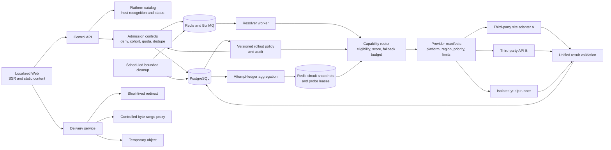

# TikDD architecture

TikDD is a multilingual public-media resolution system. Platform recognition, provider selection,
media delivery, and the SEO website are separate concerns. The platform catalog can grow without a
public contract release, while each provider independently declares which platform families it can
handle.

## System view

The current repository implements the catalog, provider manifests, deterministic ranking,
sequential fallback, normalized-result validation, an attempt ledger, transactional encrypted
delivery candidates, and disabled fixture-tested TwitterSaver/DLPanda adapters. TwitterSaver has a
reviewed redirect-only delivery path. ADR-0006 defines tuple-keyed health aggregation and
distributed circuit behavior. Attempts persist the concrete worker region; the opt-in worker health
loop aggregates distinct tasks into revisioned Redis snapshots; and the router enforces exact-key
open and half-open decisions. ADR-0007 defines production admission controls; work item 9.1 now
implements deny-first provider/platform/region rollout rules, deterministic task cohorts, durable
audit, and expiring Redis distribution. Work item 9.2 adds HMAC-protected idempotency and active
canonical-source suppression without cross-caller task sharing. Work item 9.3 adds explicit proxy
trust, privacy-preserving anonymous quotas, and distributed provider concurrency. Work item 9.4
adds independently scheduled singleton cleanup with bounded PostgreSQL stages, hard retention,
sanitized metrics, and Docker-backed repeat/cascade verification. Work item 9.5 adds
rollout-controlled metadata-only canaries and expanded protected diagnostics.
Work item 9.6 closes ADR-0007 with one Docker/CI failure-matrix gate. Production policy calibration,
yt-dlp isolation, proxying, and temporary-object delivery are later milestones. ADR-0008 now fixes
the qualification lifecycle and evidence boundary for work item 10: operator grants remain the only
way to raise traffic, while a separately audited automatic guard may only hold, reduce, or deny an
existing grant. ADR-0020 makes calendar-length calibration optional for the personal-site Beta;
measured SLOs can be refined later from real operation without fabricating evidence.
Work item 10.1 selected the disabled, `canary-ready` SSSTwitter adapter as the second X
implementation candidate after a corrected-parser canary returned two formats and one sanitized
media hostname. Delivery policy activation and worker registration remain blocked on work item 10.2.
ADR-0010 defines the personal-owner control plane for work item 12: Provider manifests and platform
host rules remain code-owned, while versioned Admin policies may only order or narrow eligible
routes. Multilingual content and SEO publish through immutable snapshots consumed by Web without a
runtime dependency on the Admin API.
Work item 12.1 implements its internal contract and persistence foundation: strict sanitized Admin
schemas, manifest-bound route preference validation, canonical locale and structured content
models, immutable revision/head tables, seeded `en`/`zh-CN` locales, and a read-only published
snapshot adapter. No authenticated Admin API or mutation is active yet.

## Request lifecycle

1. The API parses an HTTP(S) URL and matches its hostname against the curated platform catalog. It
   never fetches the submitted URL during recognition.
2. Before public rollout, the API must apply ADR-0007 idempotency, duplicate, quota, and concurrency
   admission; the worker must require an affirmative runtime rollout rule.
3. An admitted request stores a short-lived task and enqueues only the task identifiers and
   resolution input.
4. The worker builds an eligible provider set using manifest capability, rollout permission, worker
   region, and circuit state.
5. Eligible providers are ordered by the platform-specific static priority plus bounded health,
   latency, and cost signals. Static priority remains the dominant signal.
6. The router calls one provider at a time. A retryable provider failure consumes one fallback slot;
   private, paid, authenticated, DRM-protected, and other terminal failures stop immediately.
7. Every provider output is parsed as an internal `ProviderResolution`. Its public result passes
   `ResolveResultSchema`; its generic candidates pass the private `@tikdd/delivery-core` schemas.
   Provider-native fields and direct URLs never enter the public result model.
8. On success, the worker encrypts candidate secrets and atomically writes the result, replacement
   candidate set, and sanitized attempt ledger. It is the source for future health scoring and
   operational dashboards.
9. The separate delivery service can issue an opaque, one-use ticket for a redirect candidate. It
   redeems the ticket atomically, decrypts the target, revalidates the provider/mode/exact-host
   policy and all DNS answers, then emits one 302 without following the upstream URL. Controlled
   streaming and expiring objects remain deferred.

Providers are not fanned out by default. Sequential fallback minimizes upstream load, duplicated
cost, rate-limit pressure, and inconsistent winner selection. Hedged requests may be added only for
measured high-value latency cases with strict cancellation and billing controls.

## Platform catalog versus provider registry

The platform catalog answers "what service does this URL belong to?" It owns stable platform slugs,
display names, host rules, yt-dlp extractor references, and product status.

The provider registry answers "which resolver can handle this platform here and now?" Each manifest
owns its provider kind, enabled state, regions, timeout, cost weight, and an explicit priority plus
reviewed delivery modes per platform. An empty delivery-mode list is resolution-only and cannot
receive production download traffic; ADR-0012 defines the result and Admin narrowing rules.
Adding a provider does not require editing platform detection when its platforms already exist.
Adding a platform does not make it publicly supported until at least one monitored production
provider meets the launch threshold.

See [Platform catalog](../platform-catalog.md) and [Routing policy](../routing-policy.md).
Operational configuration and protected diagnostics are documented in
[Provider health operations](../provider-health-operations.md).
Production admission and runtime rollout decisions are defined in
[ADR-0007](adr/0007-rollout-admission-and-abuse-controls.md).
[ADR-0008](adr/0008-provider-qualification-and-pilot-controls.md) defines provider qualification,
pilot evidence, promotion authority, and bounded automatic rollback.
Operator configuration and emergency-stop procedures are documented in
[Provider rollout operations](../provider-rollout-operations.md).
Submission replay and duplicate suppression are documented in
[Resolve task admission](../task-admission-operations.md).
Anonymous quotas and provider concurrency are documented in
[Admission control operations](../admission-control-operations.md).
[ADR-0010](adr/0010-owner-control-plane-routing-and-publication.md) defines Admin authentication,
route-policy overlays, structured multilingual publishing, and derived SEO boundaries.

## Failure policy

| Failure class | Try next provider | Retry queue job | User-facing intent |
| --- | --- | --- | --- |
| Provider timeout, rate limit, challenge, schema change, outage | Yes, within budget | Yes | Temporarily unavailable |
| Provider says URL is unsupported | Yes | Usually no after all candidates | URL variant unsupported |
| Content missing | No by default | No | Content unavailable |
| Private, authentication, payment, DRM, geographic restriction | No | No | Terminal policy/content error |
| Invalid normalized result | Yes and trip health signal | Yes | Temporarily unavailable |

Adapters must translate upstream errors into TikDD's taxonomy. The router must never infer private or
restricted content is a transient outage and attempt to bypass it with another provider.

## Service responsibilities

### Web

- Server-rendered localized content, metadata, canonical URLs, hreflang, robots, and sitemaps.
- URL entry, task progress, format selection, and actionable status messages.
- No provider credentials, provider-specific behavior, or media transfer.

### Control API

- Validate public contracts, recognize catalog hosts, persist tasks, and enqueue work.
- Apply abuse, quota, policy, and idempotency controls before production launch.
- Expose catalog status separately from per-request task results.

### Resolver workers

- Load validated provider manifests and route by platform, region, health, cost, and priority.
- Enforce per-route and per-provider deadlines and a bounded attempt budget.
- Normalize results, persist attempts, and never stream media to a browser.
- Run browser-style adapters and yt-dlp in dedicated resource-limited runner pools in production.

### Delivery

- Accept only a task and TikDD format identifier, never an arbitrary upstream URL.
- For the current redirect-only pilot, enforce exact-host policies, public DNS answers, candidate and
  ticket expiry, atomic one-use redemption, and rejection of server-held headers.
- Range proxying, redirect-chain traversal, concurrency/size enforcement, and object egress policies
  are required only when those delivery modes are introduced.

### Persistence and control state

- PostgreSQL stores task state, normalized results, provider attempts, encrypted short-lived
  delivery candidates, and hashed one-use tickets. The private candidate and ticket schemas live in
  `@tikdd/delivery-core`; they are not Web/API contracts.
- Redis carries short-lived jobs plus expiring routing-health snapshots and half-open probe leases;
  PostgreSQL attempts remain the reconstructable source of truth.
- A future object store holds expiring artifacts created by merge or transcode jobs.

## Deployment shape

Docker Compose runs PostgreSQL and Redis for local development. Initially the TypeScript services can
share one host while remaining separate processes. Production should split the low-risk control
plane from untrusted resolver execution, and further split adapter pools by runtime kind and region.
yt-dlp and FFmpeg versions are pinned in an isolated image and can be rolled back independently of
the Web and API.

## Non-functional targets for the first production pilot

- Control API p95 under 250 ms, excluding asynchronous provider work.
- Per-platform/provider success, latency, failure-class, fallback-depth, and cost metrics.
- No more than four provider attempts and one overall route deadline per task by default.
- Circuit breakers that operate per provider, platform, and region rather than globally.
- Hard expiry for source URLs, results, delivery candidates, and temporary objects.
- Zero provider secrets, cookies, raw payloads, or upstream download URLs in client responses/logs.
