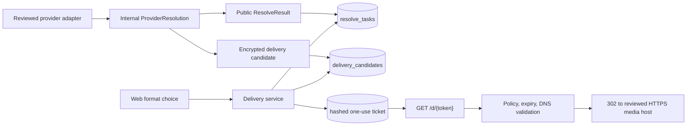

# ADR-0005: Internal delivery candidates and secure redirect boundary

- Status: Accepted
- Date: 2026-08-04
- Scope: first production-shaped X delivery pilot
- Extends: ADR-0002 and ADR-0003

## Context

Providers currently return a public `ResolveResult`. Its format identifiers describe media choices
but deliberately contain no upstream URLs, cookies, request headers, or provider-native payloads.
The delivery service accepts a task ID and format ID but returns `501` because it has no server-side
record that maps the public format to a downloadable resource.

Real delivery needs that mapping without weakening the existing boundary. Upstream URLs are
short-lived credentials in practice: their paths and query strings may contain signatures, tokens,
account identifiers, CDN routing information, or other sensitive values. They are untrusted input
even when returned by an approved provider. A provider response must not be able to define its own
network allowlist or turn TikDD into a general-purpose proxy.

The first pilot uses TwitterSaver for authorized public X posts. It needs only the smallest safe
delivery mode that the observed upstream behavior supports. Byte-range proxying, provider cookies,
and file materialization are not part of this decision's first implementation.

## Decision

### 1. Split provider output into public results and internal candidates

`ResolverProvider.resolve` will return an internal `ProviderResolution`:

```ts
interface ProviderResolution {
  result: ResolveResult;
  candidates: DeliveryCandidateInput[];
}

interface DeliveryCandidateInput {
  formatId: string;
  mode: "redirect" | "proxy" | "temporary-object";
  targetUrl: string;
  hostPolicyId: string;
  expiresAt: string;
  secretHeaders: Readonly<Record<string, string>>;
}
```

This is an internal worker/provider contract, not part of `@tikdd/contracts` public exports or
OpenAPI. The Web and control API continue to receive only `ResolveResult`.

The adapter creates the public format and its candidate together. Each candidate `formatId` must
match exactly one format in the result. In production, every returned format must have exactly one
candidate; a resolution-only result with no candidates is permitted only for development mocks and
fixture tests. The worker rejects the complete provider resolution when IDs are missing, duplicated,
or inconsistent.

The initial TwitterSaver implementation may emit only `mode: "redirect"` candidates with an empty
`secretHeaders` object. A result requiring cookies, authorization headers, or a server-side byte
stream is resolution-only until the proxy mode receives a separate implementation and security
review.

### 2. Host policy is reviewed configuration, never provider data

`hostPolicyId` references a versioned TikDD configuration entry owned by the provider integration.
That policy contains the reviewed HTTPS hostname rules and allowed delivery modes. A hostname found
in HTML, JSON, a redirect, or a candidate URL cannot add itself to the policy.

Provider page hosts and media delivery hosts are separate allowlists. Supporting a new media CDN
requires a reviewed policy change, fixtures, redirect tests, a canary, and a rollback flag. Wildcards
are allowed only for an explicitly reviewed registrable domain and never for a public suffix.

### 3. Persist candidates as short-lived encrypted records

Add a private `delivery_candidates` table with these logical fields:

- opaque candidate ID;
- task ID and normalized format ID, unique as a pair;
- provider ID, mode, and host-policy ID;
- encrypted target URL;
- encrypted secret-header payload;
- encryption key version and authenticated-encryption metadata;
- created, updated, and hard-expiry timestamps.

The target URL and secret headers use application-layer authenticated envelope encryption. The
database never stores them in plaintext. Production keys come from a deployment secret/KMS boundary;
the repository contains no usable key. Local development may use a clearly development-only key.

Candidate expiry is the earliest of:

1. the provider-declared or URL-derived expiry when it can be determined safely;
2. the task expiry;
3. the provider policy's maximum candidate lifetime.

If no upstream expiry can be established, the first redirect pilot uses a conservative policy
maximum. Expired candidates are unusable immediately and removed by scheduled cleanup. Deleting a
task cascades to its candidates and delivery tickets.

The worker adds a repository operation that stores the normalized result and replacement candidate
set in one database transaction. A retry may replace an earlier candidate set atomically; it may not
leave a new public result pointing at stale candidates. Provider attempts remain a sanitized ledger
and never receive candidate data.

### 4. Use opaque, one-purpose delivery tickets

`POST /v1/deliveries` continues to accept only a task ID and normalized format ID. After validating
the successful, unexpired task and candidate, the delivery service creates an opaque random ticket
with at least 256 bits of entropy. Only a cryptographic hash of the ticket is stored.

A ticket is bound to one candidate, one delivery mode, and one short expiry. It is redeemable once
at `GET /d/{token}`. Redemption and `redeemed_at` update are atomic, so concurrent reuse has one
winner. The URL returned by `DeliverySchema` contains only the TikDD ticket, never the upstream URL.

The initial unauthenticated product treats the unguessable task ID as a capability for requesting a
ticket. Rate limits, origin policy, task expiry, and ticket expiry limit abuse. Binding tickets to IP
addresses is rejected because mobile and privacy networks make it unreliable. A future account or
session model may add a stronger ownership check without changing provider contracts.

### 5. Redirect mode is intentionally narrow

Before issuing the redirect, the delivery service decrypts the candidate and validates:

- the ticket is valid, unused, and unexpired;
- the task and candidate are unexpired;
- the candidate mode is `redirect` and the host policy permits it;
- the URL parses as HTTPS with no embedded credentials;
- the hostname matches the static media-host policy;
- DNS resolution returns only public, non-reserved addresses;
- the URL length and structure meet configured limits.

Redirect mode returns a short-lived `302` without fetching media bytes on the server. Because TikDD
does not dereference the target, it cannot inspect redirects that the user's browser may later follow.
Redirect mode is therefore permitted only for reviewed media-host policies whose redirect behavior
is acceptable. If every hop must be inspected, that host is not eligible for redirect mode and must
wait for controlled proxy delivery.

Future proxy mode must resolve DNS and revalidate the static host policy after every redirect,
connect to the validated address without a second uncontrolled resolution, restrict methods and
headers, sniff content type, enforce byte/range/time/concurrency budgets, and never forward
user-supplied credentials. That work requires a later ADR or an explicit amendment before enablement.

### 6. Logging and observability stay metadata-only

Application logs, traces, metrics, analytics, errors, and the provider-attempt ledger must exclude:

- source and canonical URLs;
- decrypted target URLs or query strings;
- cookies and secret headers;
- raw provider payloads;
- delivery tokens and token hashes;
- media titles, thumbnails, and author names.

Permitted operational fields are opaque task/candidate IDs, provider ID, platform, region, host-policy
ID, delivery mode, status, normalized failure code, duration, and byte counts where applicable.

## Data flow



## Invariants

1. Public schemas and OpenAPI never contain upstream delivery data.
2. A public format ID alone is never sufficient to choose an arbitrary URL.
3. Provider output cannot broaden a static host policy.
4. Candidate and ticket secrets are encrypted or hashed at rest and always redacted in logs.
5. Result and candidate persistence is atomic.
6. Expiry is checked when a ticket is created and again when it is redeemed.
7. Redirect-only delivery never sends media bytes through the control API or resolver worker.
8. Private, paid, authenticated, DRM-protected, or policy-restricted results never create candidates.
9. Development mock candidates cannot be created or redeemed when `NODE_ENV=production`.
10. Failure to validate safely returns an error; it never falls back to an unchecked redirect.

## Rejected alternatives

### Put direct URLs in `ResolveResult`

Rejected because URLs would cross the public API, become browser-visible credentials, be captured by
analytics and logs, and couple provider payload changes to the public contract.

### Store the complete provider response

Rejected because it increases secret and personal-data retention, makes schema changes dangerous,
and violates the normalized-provider boundary.

### Let each candidate carry its own allowed hosts

Rejected because untrusted provider data would become security policy and could authorize an
attacker-controlled or internal destination.

### Encode the upstream URL in a signed public token

Rejected for the first pilot because encryption/key rotation, token length, revocation, one-use
semantics, and accidental logging are clearer with an opaque database-backed ticket.

### Start with a general byte proxy

Rejected because proxying expands SSRF, DNS rebinding, content validation, bandwidth, range,
concurrency, and abuse responsibilities before redirect delivery has been proven.

## Consequences

- Providers gain a small internal contract change and must map formats to candidates explicitly.
- Persistence gains encrypted short-lived state and key-rotation operations.
- The delivery service becomes the only component allowed to decrypt an upstream target.
- Some successfully resolved formats may remain non-deliverable until their host policy and mode are
  reviewed; the UI must not show an enabled download action for those formats.
- Redirect delivery is fast and bandwidth-light, but it supports only reviewed URLs that need no
  secret server-held headers.
- Proxy and temporary-object modes remain compatible with the model but are not authorized by this
  ADR's initial implementation.

## Implementation and verification order

1. Add internal schemas and consistency tests without changing public schemas.
2. Add candidate/ticket migrations, repository APIs, encryption boundary, and expiry cleanup.
3. Update the router and worker to validate and persist `ProviderResolution` atomically.
4. Update TwitterSaver fixtures and adapter output; keep delivery disabled until media hosts are
   reviewed from an authorized canary.
5. Implement ticket creation and redirect redemption.
6. Add SSRF, DNS, redirect-policy, expiry, tamper, replay, concurrency, migration, and redaction tests.
7. Run Docker-backed end-to-end tests and the authorized live canary before any percentage rollout.

OpenAPI changes only when ticket creation/redemption behavior is implemented. The internal candidate
schema itself must never be added to OpenAPI.
