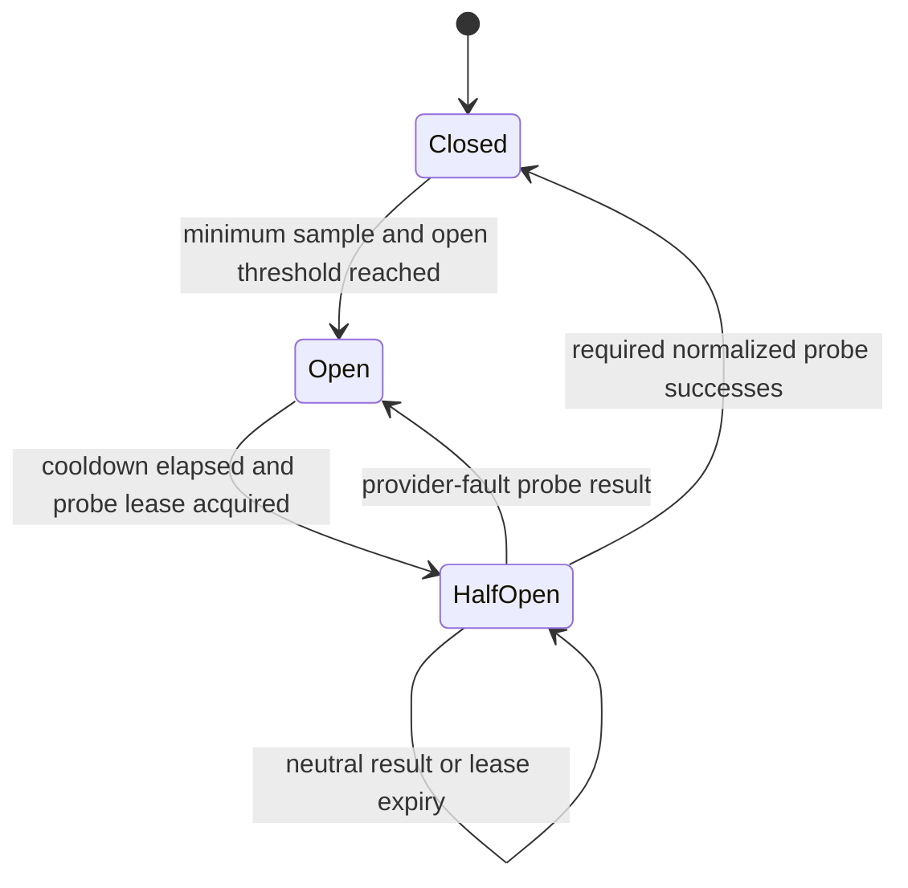

# ADR-0006: Provider health aggregation and distributed circuit breakers

- Status: Accepted
- Date: 2026-08-07
- Scope: work item 8 reliability control plane
- Extends: ADR-0004

## Context

ADR-0004 requires provider health and circuit state to participate in capability routing before
TikDD runs multiple resolver workers in production. The repository currently records a sanitized
provider-attempt ledger, but an attempt does not contain the actual worker region. The router's
health source is also keyed only by provider ID. A global circuit built on those fields could let a
failure in one platform or region disable an otherwise healthy provider everywhere.

Provider failures do not all carry the same operational meaning. A schema change or invalid
normalized result is strong evidence that an integration is broken. A timeout, challenge, rate
limit, or upstream outage may be transient or regional. Content-not-found, private, authenticated,
paid, DRM, geographic-policy, and unsupported-URL outcomes describe the submitted content or route
capability and must not be treated as provider availability failures.

Circuit state must be shared across workers, recover after process restarts, avoid simultaneous
half-open probes, and remain explainable from sanitized durable observations. It must not make Redis
a system of record or put submitted URLs and media metadata into operational state.

## Decision

### 1. Key every health decision by provider, platform, and actual region

The circuit key is the tuple:

```ts
interface ProviderCircuitKey {
  providerId: string;
  platform: string;
  region: string;
}
```

`region` is the validated region of the worker that made the provider call. A provider manifest may
declare `"*"` eligibility, but `"*"` is never persisted as an observed attempt region. The current
single-region development environment records `global`; production deployments use their explicit
worker-region slug.

There is no provider-global circuit and no implicit roll-up that can suppress other platforms or
regions. Fleet-wide disablement belongs to an explicit operator kill switch, not inferred health.

### 2. Keep attempts durable and circuit state derived

PostgreSQL `provider_attempts` remains the source of truth for sanitized observations. It gains a
required `region` column and an index ordered by provider, platform, region, and observation time.
Existing attempts are backfilled as `global` because they were produced by the current global local
worker configuration.

Aggregation uses at most one latest observation per task and circuit key in a window. Queue retries
of the same task must not manufacture the minimum independent sample size needed to open a circuit.
Every snapshot records its observation window, distinct-task sample count, policy version, and
calculation time so operators can identify stale or insufficient data.

Redis stores only replaceable operational state:

- current state: `closed`, `open`, or `half-open`;
- categorized counts and rates, success rate, and bounded p95 latency;
- sample count and `insufficient_data` marker;
- open reason, transition time, cooldown deadline, and policy version;
- a short-lived half-open probe lease.

Snapshots have a bounded TTL and can be rebuilt from PostgreSQL. Media titles, authors, source or
canonical URLs, provider payloads, direct URLs, cookies, headers, tokens, and user identifiers are
forbidden from attempts, snapshots, transition logs, metrics, and diagnostics.

### 3. Classify observations before applying thresholds

The health policy classifies normalized outcomes into these operational groups:

| Group | Failure codes | Circuit effect |
| --- | --- | --- |
| Success | Valid normalized provider resolution | Positive health sample |
| Integrity | `provider_schema_changed`, `invalid_result` | Strong provider-fault signal |
| Access friction | `provider_challenge`, `provider_rate_limited` | Regional/provider-fault signal |
| Availability | `provider_timeout`, `provider_unavailable`, transient `internal_error` | Transient provider-fault signal |
| Neutral content/policy | `content_not_found`, `content_private`, `authentication_required`, `payment_required`, `drm_protected`, `geo_restricted` | Recorded but excluded from opening and recovery ratios |
| Neutral capability | `unsupported_url` | Recorded as a capability gap, excluded from circuit health |

Integrity, access-friction, and availability groups have separate configurable thresholds. A single
severe observation may be visible diagnostically but cannot open a production circuit before the
policy's distinct-task minimum sample size is met. Production thresholds are versioned
configuration and will be calibrated from authorized pilot observations; they are not embedded as
unreviewed constants in adapters or Web/API conditionals.

Canary observations use the same normalized taxonomy and circuit key. They may be reported
separately, but they do not bypass the configured state-transition policy.

### 4. Use hysteresis and an atomic half-open probe lease

The state machine is:



- `closed`: the provider is eligible and receives a bounded health/latency score adjustment.
- `open`: the exact circuit key is ineligible until its cooldown expires. Other keys are unaffected.
- `half-open`: only the worker holding the Redis lease may make a probe. Other workers treat the key
  as open until the probe completes or the lease expires.

Opening and recovery use different thresholds. Recovery requires configured normalized successes,
not merely elapsed time. A neutral content or capability result proves neither a healthy complete
resolution nor a provider fault: it releases or expires the lease and permits a later probe without
closing the circuit. A provider-fault result reopens the circuit with a bounded cooldown. Lease and
state changes use atomic Redis operations so multiple workers cannot all probe simultaneously.

Cooldown growth, maximum cooldown, recovery-success count, observation windows, minimum samples,
and failure-group thresholds belong to a runtime-validated, versioned policy. State always records
the policy version that produced it. Policy changes are reviewed configuration with rollback.

### 5. Separate health calculation from routing permission

The routing health boundary accepts a complete `ProviderCircuitKey`; `get(providerId)` is not a
valid production interface. It returns a snapshot for deterministic scoring and provides an atomic
permission operation for half-open probing. The router remains responsible for the existing
manifest, region, attempt-count, provider-timeout, and overall-route budgets.

Static platform priority remains the dominant ranking signal. A closed circuit may contribute only
bounded success and latency adjustments. Missing, stale, or insufficient snapshots are neutral and
must not invent a favorable score. An open circuit is excluded. A half-open circuit is eligible only
with its probe permit and still consumes the normal attempt and route-time budgets.

The result of a provider attempt is persisted before it is used to publish a replacement snapshot
or complete a circuit transition. This keeps operational decisions traceable to durable sanitized
evidence. A short bounded propagation delay is acceptable; unbounded stale state is not.

### 6. Degrade safely when Redis or aggregation is unavailable

Redis health-state failure must not turn every resolver request into a control-plane outage. A
worker may use its last non-stale in-process snapshot. When no usable snapshot exists, routing
degrades to static manifest eligibility and priority with a neutral health adjustment while
preserving provider timeouts, sequential fallback, route deadlines, and attempt limits.

This fail-soft behavior emits a sanitized degraded-health signal and never bypasses a terminal
content/policy decision. Explicit provider/platform/region and fleet kill switches remain required
before public rollout in work item 9; inferred circuit health is not a substitute for operator
control.

The aggregator runs outside the Web request path and uses a distributed singleton lease or a unique
scheduled job. Failure to refresh a snapshot makes it stale and neutral rather than permanently
open or closed. After Redis recovery, snapshots are rebuilt from the current PostgreSQL window.

### 7. Keep diagnostics protected and metadata-only

A later protected, read-only diagnostics endpoint may expose circuit keys, state, policy version,
sample sufficiency, categorized counts, bounded latency, transition reason, fallback depth, and
sanitized canary health. It must not share authentication or caching semantics with public resolve
or SEO routes, and it must never expose submitted URLs, media metadata, raw failures, secrets, or
delivery candidates.

This ADR does not add a public API field or authorize a public operator UI. The authentication and
operator-role boundary must be defined before the diagnostics endpoint is enabled.

## Invariants

1. A circuit decision always targets exactly one provider, platform, and actual worker region.
2. Content, permission, DRM, payment, geographic-policy, and unsupported-URL outcomes cannot open a
   provider circuit.
3. Queue retries of one task cannot alone satisfy the distinct-task minimum sample size.
4. Only one bounded half-open probe lease is active per circuit key unless a reviewed policy
   explicitly permits a larger number.
5. Static priority remains dominant and all provider calls remain sequential and bounded.
6. Redis circuit state is expiring, replaceable, and reconstructable from PostgreSQL observations.
7. Missing health infrastructure does not remove route timeouts, attempt limits, or terminal-error
   behavior.
8. Public contracts and OpenAPI contain no provider health, circuit, attempt, or diagnostic fields.
9. Operational health data contains no submitted URLs, media metadata, provider payloads, direct
   links, credentials, or user identifiers.
10. Every state transition is attributable to a policy version and sanitized observation window.

## Rejected alternatives

### One circuit per provider

Rejected because a challenge or schema failure for one platform or region would disable healthy
capabilities elsewhere.

### Keep circuit state only in worker memory

Rejected because workers would disagree, restart into empty state, and issue simultaneous probes.

### Treat Redis as the attempt ledger

Rejected because expiring operational state is not an auditable source of truth. PostgreSQL remains
the durable observation store.

### Count every queue retry as an independent sample

Rejected because one problematic URL or upstream event could rapidly manufacture enough samples to
open a circuit and amplify retry behavior.

### Include all failures in one error-rate threshold

Rejected because content and policy outcomes are not provider outages, while schema failures need a
different response from ordinary timeouts or rate limits.

### Fail closed whenever health state is unavailable

Rejected because a Redis or aggregator outage would disable all provider routes. TikDD instead
falls back to static bounded routing and relies on explicit kill switches for operator shutdown.

## Consequences

- `ProviderAttempt` and `provider_attempts` gain an actual region, requiring coordinated contract,
  migration, repository, worker, and test changes in work item 8.1.
- The production health interface becomes tuple-keyed and gains asynchronous probe-permission
  semantics; the current provider-ID-only source is retained only until that implementation lands.
- Redis becomes part of the distributed routing control path but remains a rebuildable cache, not a
  source of truth.
- Circuit behavior is deterministic and testable, but policy calibration and operational alerts are
  required before production enablement.
- Work item 9 must still provide explicit flags, quotas, deduplication, cleanup, and kill switches.

## Implementation and verification order

1. Add the attempt-region migration, tuple-key contract, repository writes, indexes, and migration
   tests.
2. Implement a pure health aggregator with distinct-task sampling, categorized outcomes, windows,
   minimum samples, and hysteresis tests.
3. Add expiring Redis snapshots and atomic half-open lease/state operations with concurrency tests.
4. Integrate tuple-key health and probe permission into deterministic provider ranking.
5. Add failure-injection tests proving platform/region isolation, fallback, recovery, stale-state
   behavior, and absence of queue retry amplification.
6. Add protected metadata-only diagnostics after its authentication boundary is defined.
7. Run Docker-backed end-to-end tests and `pnpm check` before marking work item 8 complete.

## Implementation status

Work item 8.1 completed the first step on 2026-08-07. `ProviderAttempt` now requires a validated
concrete region, provider manifests validate either concrete regions or `"*"`, and the router health
source receives the complete provider/platform/region key. Migration `0004` backfills existing
attempts as `global`, rejects wildcard observations, and adds the tuple health index. Unit tests and
a Docker-backed PostgreSQL verification cover contract validation, routing keys, persistence,
constraints, and the index. The following work items then implemented aggregation and asynchronous
probe permission.

Work items 8.2–8.5 implemented the remaining boundary on 2026-08-07. `@tikdd/routing-health` owns
runtime-validated policies, distinct-task window aggregation, categorized failures, hysteresis,
revisioned Redis snapshots, atomic half-open leases, and fail-soft routing reads. The worker runs the
aggregator only after explicit opt-in with a versioned policy. The router consumes exact tuple state,
and a development-only failure-injection adapter covers fallback and attempt budgets. A separately
credentialed internal endpoint exposes only sanitized circuit metadata. Public Web and OpenAPI
contracts remain unchanged.
