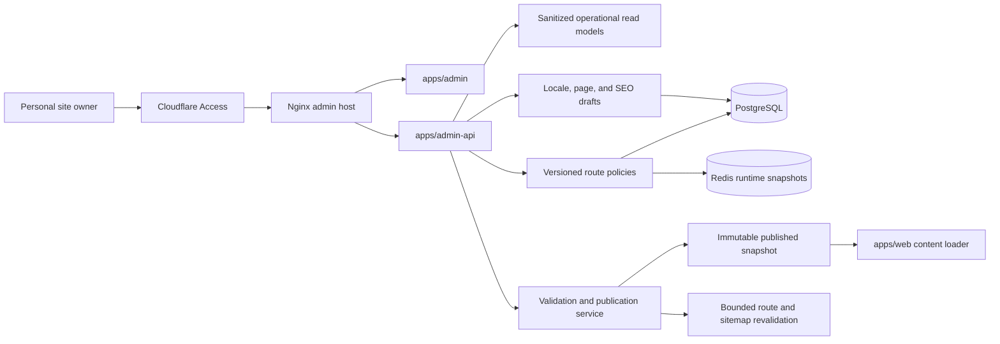

# Work item 12 implementation plan — TikDD owner control plane

## Outcome

Work item 12 turns the approved Routing Observatory prototype into a complete owner control plane.
It covers daily operations, Provider routing, platform presentation, multilingual content, and page
SEO configuration while keeping security-sensitive adapter and delivery behavior code-owned.

The target is one personal-site owner. There are no teams, roles, reviewer queues, or compliance
audit product. Technical revision metadata remains because safe publication, conflict detection,
and rollback require it.

The detailed product model and workflows are defined in `docs/admin-product-design.md`.

## Architecture direction

Deployment assumptions remain `tikdd`, region `nl`, and Cloudflare/Nginx, but formal deployment is
not part of this work item.

## Boundary decisions to preserve

- Public Web never calls the authenticated Admin API and never reads drafts.
- Admin browser never receives diagnostics bearer tokens, secrets, submitted URLs, task IDs,
  candidate media URLs, cookies, headers, or raw Provider responses.
- Provider manifests remain the code-owned capability and eligibility baseline.
- Admin route policies may narrow, allocate, or order eligible Providers but cannot make an
  unsupported route eligible or bypass circuit, delivery, host, or rollout safety.
- Platform host rules and spoof-host tests remain code-reviewed in `@tikdd/platform`.
- Page templates and structured content schemas remain code-owned; Admin edits validated content.
- Tasks, results, delivery, API, and Admin routes remain non-indexable regardless of Admin input.
- Sitemap, canonical, hreflang, and redirects are derived and validated from published state.
- Public contracts in `openapi/tikdd.v1.yaml` remain separate from internal Admin contracts.

## Delivery sequence

### Work item 12.0 — Control-plane, routing-policy, and publication ADR

Write ADR-0010 before adding production Admin APIs or mutable configuration.

Decide:

- dedicated `apps/admin-api`, Cloudflare Access JWT validation, direct-origin rejection, Nginx trust
  headers, same-origin/CSRF controls, local-only development auth, CSP, `no-store`, and `noindex`;
- configuration ownership between Provider manifests, platform catalog code, route policies,
  editorial drafts, and published snapshots;
- durable route-policy revisions, exact tuple addressing, sequential bounded fallback, rollout and
  circuit precedence, idempotency, optimistic concurrency, propagation, and rollback;
- locale/page/SEO persistence, draft and published states, immutable snapshot promotion, cache
  invalidation/revalidation, and recovery from partial publication failure;
- privacy denylist, bounded reads, failure behavior, and fields forbidden from Admin storage/logs;
- public Web fallback when the editorial store or revalidation service is unavailable.

Exit gate:

- code-owned and Admin-owned configuration is unambiguous;
- neither route policy nor editorial publication can partially appear successful;
- production authentication and direct-origin failure are fail-closed;
- review confirms no public resolve/delivery contract change.

Estimated effort: 1 day.

Implementation status (2026-08-11): complete. [ADR-0010](architecture/adr/0010-owner-control-plane-routing-and-publication.md)
accepts the private owner authentication boundary, code-versus-Admin configuration ownership,
non-granting route-policy overlay, immutable content snapshot publication, derived SEO rules,
failure recovery, and privacy invariants. No runtime behavior or public contract changed.

### Work item 12.1 — Admin contracts, persistence schema, and fixture system

Add internal runtime-validated contracts and migrations for:

- overview, route summary/detail, alerts, and dependency readiness;
- Provider manifest projection and effective route-policy drafts/revisions;
- platform presentation state and publication eligibility;
- locale registry, page definitions, localized revisions, safe SEO fields, redirects, and immutable
  published snapshots;
- mutation and publication receipts with current/expected revision and propagation status.

Fixtures must cover long labels, RTL, missing translations, slug collisions, stale/partial
operations, open circuits, active denies, publication conflicts, and rollback.

Exit gate:

- runtime schemas reject arbitrary URLs, HTML/scripts, secret/media fields, and ineligible routes;
- migrations are reversible and preserve existing rollout-control data;
- locale IDs are validated BCP 47 tags, not a closed frontend enum;
- Provider and platform IDs remain manifest/catalog slugs;
- internal schemas do not enter the public OpenAPI document.

Estimated effort: 1.5–2 days.

Implementation status (2026-08-11): complete. `@tikdd/admin-contracts` now owns strict sanitized
operations, route-policy, locale, structured page, SEO, receipt, and published-snapshot schemas plus
boundary fixtures. Migration `0011` adds revision/head persistence, seeded `en`/`zh-CN` locales,
published snapshot pointers, and expiring HMAC-only command receipts. The read-only persistence
adapter validates every returned row and snapshot envelope. PostgreSQL application and rerun passed;
no Admin endpoint or runtime mutation was enabled. See `docs/work-item-12-1-implementation.md`.

### Work item 12.2 — Authenticated Admin API foundation

Create `apps/admin-api` as a separate Fastify service with owner authentication and same-origin
browser access.

Initial reads:

- `GET /admin/v1/overview`;
- `GET /admin/v1/routes` and one exact route detail;
- `GET /admin/v1/providers` and `GET /admin/v1/platforms`;
- `GET /admin/v1/runtime` for readiness/freshness only;
- initial locale/page/SEO read endpoints against seeded content.

Production requires a valid Cloudflare Access JWT for the configured owner and a reviewed origin
boundary. Development auth is explicit, loopback-only, and refuses production startup.

Exit gate:

- spoofed headers, wrong audience, expired JWT, direct origin, and missing auth are rejected;
- all responses are schema-validated, sanitized, `no-store`, and `noindex`;
- partial PostgreSQL/Redis sources return explicit degraded state, not invented healthy values;
- browser-facing endpoints cannot proxy arbitrary internal paths.

Estimated effort: 1.5 days.

Implementation status (2026-08-11): complete. `apps/admin-api` is a dedicated loopback-only,
read-only Fastify service with explicit development auth and fail-closed Cloudflare Access
verification for production. Exact Host/Origin controls, independent Nginx origin proof, security
headers, output privacy validation, bounded reads, partial dependency states, and rollout/Pilot
Guard composition are covered by the work-item test gate. See
`docs/work-item-12-2-implementation.md`.

### Work item 12.3 — Admin shell, overview, operations, and alerts

Expand the current `apps/admin` navigation to the seven-area product architecture and connect the
approved Routing Observatory to real sanitized reads.

Implement:

- server-rendered initial data and bounded browser refresh;
- Overview attention queue and freshness/dependency summaries;
- route selection, platform/region/state filters, bounded charts, and textual summaries;
- Alerts derived from open circuits, active denies, stale scheduler/data, queue pressure, delivery
  degradation, content gaps, and SEO blockers;
- healthy, empty, stale, insufficient-data, unavailable, and partial-dependency states.

Exit gate:

- the owner can identify an exact degraded route and its safe next action without shell access;
- no credential or forbidden field appears in HTML, network responses, logs, or browser storage;
- desktop, tablet, and mobile have no P0/P1 Product Design or accessibility finding;
- monitoring remains read-only until later mutation gates pass.

Estimated effort: 1.5–2 days.

Implementation status (2026-08-11): complete. `apps/admin` now uses server-rendered, runtime-
validated Admin API reads and a fixed same-origin refresh endpoint. The owner brief, attention
queue, real Routing Observatory, exact route inspector, Provider/platform coverage, publishing
readiness, and runtime dependencies all preserve partial and unavailable states. Desktop/mobile
rendered QA has no open P0/P1 finding. See `docs/work-item-12-3-implementation.md` and
`docs/design/work-item-12-3-design-qa.md`.

### Work item 12.4 — Provider route policy and bounded controls

Implement the first mutable control-plane domain.

Capabilities:

- compare manifest baseline, current published policy, draft, and calculated effective order;
- set ordered eligible Providers for one platform/region, staged allocation, and supported bounded
  concurrency overrides;
- run one preconfigured bounded probe for an exact eligible route;
- exact pause/deny, emergency deny, resume-never-grants, publish, discard, and rollback;
- authoritative PostgreSQL/Redis propagation verification.

All mutations require owner auth, same-origin/CSRF validation, exact scope, expected revision,
idempotency key, bounded reason, confirmation, and server-side eligibility validation. No endpoint
accepts arbitrary source URLs or manifest JSON.

Exit gate:

- policy cannot enable unsupported Providers, bypass circuit/rollout decisions, or create parallel
  unbounded fallback;
- conflicting revisions reload rather than overwrite;
- resume never increases allocation or creates a grant;
- probe lease, duplicate submission, Redis loss, and propagation failure remain bounded/fail-closed;
- rollback creates a new revision and restores the previous effective policy.

Implementation status (2026-08-12): complete. Versioned route-policy drafts compare the Manifest
baseline, current publication, draft, and effective order. Publish/discard/rollback, narrowing
concurrency caps, exact pause/emergency deny, resume-never-grants, and preconfigured bounded probes
use owner auth, same-origin CSRF, exact confirmation, idempotency, expected revisions, server-side
eligibility, and explicit propagation receipts. PostgreSQL remains authoritative; monotonic Redis
route-policy and rollout snapshots are verified before success is reported. Workers apply
preferences only after rollout, Pilot Guard, circuit, and concurrency authorization. See
`docs/work-item-12-4-implementation.md` and `docs/design/work-item-12-4-design-qa.md`.

Estimated effort: 2–2.5 days.

### Work item 12.5 — Platform management and publication readiness

Build the Platforms area around the catalog rather than making the catalog an arbitrary database
registry.

Implement:

- catalog status, explicit recognized hosts, Provider/region coverage, route health, locale
  coverage, page publication, and SEO readiness;
- editable public display state, support label, visibility, and page association;
- read-only code-owned host rules, extractor keys, and adapter capability;
- a readiness gate requiring stable catalog state and at least one monitored eligible production
  route before an indexable platform page can publish.

Exit gate:

- Admin cannot create an arbitrary host rule or claim unsupported Provider capability;
- a presentation-status change cannot alter URL recognition or delivery allowlists;
- planned, experimental, paused, and stable states render distinctly on Admin and public pages;
- spoof-host and routing contract tests remain green.

Implementation status (2026-08-12): complete. The Admin now composes code-owned catalog and
Provider-manifest facts with route, locale, page, SEO, and versioned presentation state. Public
display fields can be drafted, published, discarded, or rolled back, while `listed` publication is
revalidated against stable catalog state, a monitored eligible route, published locale coverage,
page association, and SEO readiness. Hosts, extractor keys, adapter capability, route eligibility,
and delivery behavior remain immutable from Admin. See `docs/work-item-12-5-implementation.md` and
`docs/design/work-item-12-5-design-qa.md`.

Estimated effort: 1 day.

### Work item 12.6 — Locale registry and structured content model

Replace the hardcoded locale/copy assumption with a versioned editorial model while retaining
code-owned templates and schemas.

Implement:

- seeded `en` and `zh-CN`, validated addition of future BCP 47 locales, display name, direction,
  fallback, enabled state, and publication readiness;
- page definitions for homepage, platform, help/guide, FAQ, and legal templates;
- localized structured fields, safe Markdown, draft/ready/published/archived states, and revision
  comparison;
- shared navigation/footer/legal blocks and a page-by-locale coverage matrix;
- server-side validation that prevents raw HTML/scripts and silently published fallback copy.

Exit gate:

- adding a supported locale does not require a new locale enum or duplicated page component;
- default locale and published-locale safety rules are enforced;
- drafts never appear in the public content loader;
- missing and fallback content are visually and semantically distinct.

Implementation status (2026-08-12): complete. The control plane now supports canonical future
BCP 47 Locale drafts, protected default/fallback relationships, code-owned homepage/platform/
guide/FAQ/legal definitions, discriminated structured content, Safe Markdown, shared navigation/
footer/legal blocks, and an explicit Page × Locale coverage matrix. Missing, fallback, draft,
ready, published, and archived states remain distinct; no draft enters public Web. See
`docs/work-item-12-6-implementation.md` and `docs/design/work-item-12-6-design-qa.md`.

Estimated effort: 2 days.

### Work item 12.7 — Content editor, preview, and publication pipeline

Build the owner publishing workflow.

Implement:

- structured page editor with field-level errors and a validation summary;
- locale-aware desktop/mobile preview using the real public templates;
- draft/published diff and affected-path summary;
- atomic immutable snapshot publication, bounded path revalidation, propagation receipt, and
  rollback as a new revision;
- idempotency and expected-revision behavior for publish/unpublish/rollback.

Exit gate:

- preview cannot mutate or expose live state;
- a failed database promotion or revalidation is explicit and recoverable;
- Web serves the previous known-good snapshot when publication fails;
- rollback restores content and associated SEO state consistently.

Implementation status (2026-08-12): complete. The Admin now provides a code-owned structured
proofing desk, locale/page navigation, live desktop/mobile template preview, page draft/ready
commands, an explicit diff and affected-path review, exact deployment confirmation, and immutable
snapshot publication/rollback/retry commands. Publication uses a two-phase boundary: a candidate is
durable before revalidation, but the active head changes only after a positive Web acknowledgement;
a failed candidate remains explicit and retryable while the previous known-good snapshot stays
active. The public Web acknowledgement adapter itself remains deliberately fail-closed until work
item 12.9. See `docs/work-item-12-7-implementation.md` and
`docs/design/work-item-12-7-design-qa.md`.

Estimated effort: 1.5–2 days.

### Work item 12.8 — SEO configuration and technical publication rules

Implement page-level SEO without making safety-critical robots behavior freely editable.

Capabilities:

- localized slug, search title/description, social fields, and approved image references;
- search/social preview, field validation, slug collision detection, and safe same-origin redirects;
- canonical and hreflang generation/preview from the published locale group;
- sitemap eligibility and preview derived from stable localized pages;
- platform-page eligibility, redirect-loop, indexability-conflict, and structured-data checks;
- immutable `noindex` for task, result, delivery, API, and Admin surfaces.

Exit gate:

- no draft, ineligible platform page, or non-indexable route enters sitemap/hreflang;
- canonical and redirect targets cannot escape the configured public origin;
- changing a published slug requires a validated redirect or explicit safe retirement;
- generated metadata, robots, sitemap, and structured data pass automated and rendered tests.

Implementation status (2026-08-12): complete. Drafts may now express localized SEO intent before
publication, while a derived index passport remains authoritative for canonical paths, hreflang,
sitemap eligibility, safe redirects, platform eligibility, and code-owned structured-data
templates. Reserved private routes, collisions, redirect chains/loops, and published slug changes
without migration redirects block snapshot publication. See `docs/work-item-12-8-implementation.md`
and `docs/design/work-item-12-8-design-qa.md`.

Estimated effort: 1.5–2 days.

### Work item 12.9 — Public Web published-content integration

Status: complete on 2026-08-12. See `docs/work-item-12-9-implementation.md`.

Move `apps/web` from hardcoded locale copy to the immutable published snapshot behind a typed
content loader, without coupling it to `apps/admin-api`.

Implement:

- server-side published-content loader with cache tags/versioning and known-good fallback;
- generic locale resolution, locale switching, localized route generation, and 404 behavior;
- homepage and platform/help/legal templates backed by structured content;
- canonical/hreflang, metadata, redirects, sitemap, and robots output from the published snapshot;
- startup/health visibility for snapshot freshness without exposing drafts.

Exit gate:

- public Web remains available with the last known-good snapshot during Admin/editorial outages;
- draft/unpublished records cannot be fetched through public routes;
- current `en` and `zh-CN` content and SEO behavior remain regression-tested;
- task/result pages remain noindex and absent from sitemap.

Estimated effort: 2 days.

### Work item 12.10 — Settings and recovery tools

Complete the daily owner experience with tightly scoped settings.

Implement:

- site identity and default social metadata;
- locale registry controls and publication defaults;
- read-only deployment, region, Access, Nginx, database, Redis, scheduler, and snapshot readiness;
- secret presence as configured/missing only;
- recovery actions limited to retry publication, rebuild a snapshot, invalidate affected content
  cache, or roll back a known revision.

Do not add raw log viewers, task/source lookup, arbitrary shell/SQL, secret editing, adapter editing,
or a general-purpose cache purge.

Exit gate:

- every setting maps to a bounded owner decision;
- recovery actions are idempotent, scoped, and verified;
- secret values and forbidden operational fields never render.

Estimated effort: 1 day.

### Work item 12.9.1 — Platform-first Provider capability routing closure

Status: complete on 2026-08-13. See `docs/work-item-12-9-1-implementation.md` and
`docs/design/work-item-12-9-1-design-qa.md`.

The owner workflow now uses one exact platform/region scope across the capability matrix, runtime
observatory, policy preview, and guarded command boundary. Platforms without current route samples
still expose the code-owned Manifest baseline, but cannot enable route-specific mutations. The
matrix distinguishes declared delivery capability, deployment eligibility, resolution-only routes,
and unsupported combinations. Desktop and 390-pixel Product Design evidence closes all P0/P1
findings.

### Work item 12.11 — Integrated verification and baseline

Create `pnpm verify:work-item-12` with no live Provider requests.

The gate covers:

1. Admin authentication, origin, CSRF, CSP, `no-store`, and `noindex`.
2. Runtime contracts, privacy-field denial, partial sources, and stale/freshness semantics.
3. Route eligibility/order/allocation, bounded fallback, deny precedence, conflicts, propagation,
   probe leases, resume-never-grants, and rollback.
4. Platform code/admin ownership and indexable-page readiness.
5. Locale validation, content schemas, draft isolation, atomic publication, and known-good fallback.
6. Slugs, redirects, canonical, hreflang, sitemap, robots, and structured-data generation.
7. Desktop/mobile fixture and accessibility tests for all critical states.
8. `pnpm check` and production builds.

Exit gate:

- a clean checkout passes without Cloudflare or live Provider access;
- production Admin services refuse incomplete auth/origin configuration;
- no test rows, Redis keys, media, submitted URLs, secrets, or browser residue remain;
- the work item can be committed as a separate verified baseline before deployment.

Estimated effort: 1–1.5 days.

## Milestones and order

| Milestone | Work items | Usable outcome | Estimate |
| --- | --- | --- | --- |
| A — Control-plane foundation | 12.0–12.3 | Authenticated operations and real read-only observability | 5–6.5 days |
| B — Routing configuration | 12.4–12.5 | Safe Provider routing and platform readiness | 3–3.5 days |
| C — Multilingual publishing | 12.6–12.7 | Locale/page drafts, preview, publish, and rollback | 3.5–4 days |
| D — SEO and public integration | 12.8–12.9 | Validated SEO and published Web content | 3.5–4 days |
| E — Closure | 12.10–12.11 | Recovery/settings and one integrated verification gate | 2–2.5 days |

The implementation order is deliberately dependency-driven: routing mutations wait for the
authenticated boundary; public content waits for immutable publication snapshots; SEO generation
waits for the locale/page model.

## Product Design QA checkpoints

- After 12.3: Overview, Observatory, Alerts, global navigation, and all operational states.
- After 12.4: route policy diff, confirmation, propagation, conflict, and rollback workflows.
- After 12.6: locale coverage matrix, RTL/long labels, missing/fallback content, and mobile editing.
- After 12.8: search/social previews, error summaries, sitemap/hreflang views, and slug changes.
- After 12.9: side-by-side Admin preview versus real public route on desktop and mobile.

Every checkpoint captures actual rendered evidence and updates the existing Admin design QA. P0/P1
findings block the next milestone.

## Explicitly deferred

- Formal deployment, DNS, Cloudflare, and Nginx changes.
- Multi-user identity, roles, approvals, and audit-center UI.
- Provider adapter implementation, arbitrary manifest editing, host-rule editing, and secret editing.
- Generic CMS page builders, custom scripts/styles, arbitrary JSON-LD, and automated thin content.
- Raw logs, raw tasks, source URL search, media preview, and downloadable URLs in Admin.
- Analytics/Search Console integrations, asset uploads, translation vendors, and AI translation.
- yt-dlp rollout, proxy delivery, FFmpeg, and new Provider implementation unrelated to Admin.

## Next executable step

Implement work item 12.10: add bounded settings and recovery tools without exposing secrets, raw
logs, arbitrary cache purge, shell, SQL, task URLs, or Provider capability editing.
