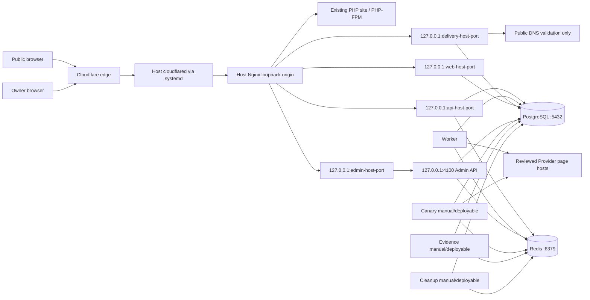

# Work Item 16 Phase A — production deployment design freeze

- Status: Phase A.1 infrastructure alignment complete; Phase B is not authorized
- Date: 2026-08-30
- Branch: `codex/work-item-16-deployment-design`
- Deployment identity: `tikdd`
- Reviewed production region: `nl`
- Scope: deployment architecture and implementation inputs only

This document freezes a repository-compatible production deployment design before any production
Dockerfile, Compose file, Nginx configuration, scheduler, CI/CD deployment workflow, or cloud
resource is created. It does not enable a Provider, create a rollout allocation, execute a Canary,
contact production infrastructure, or begin Work Item 17.

## 1. Current runtime inventory

The repository is a pnpm workspace. `pnpm check` builds the two Next applications and type-checks
the TypeScript services, but the non-Next `build` commands currently use `noEmit`; their reviewed
production entry points therefore still execute TypeScript through `tsx`. Phase B must package the
repository accordingly unless a separately reviewed compiled-output change is made.

### Long-running request and queue services

| Service | Classification | Current production start | Dependencies | Listener and public exposure | Current health | Persistence, restart, and secrets |
| --- | --- | --- | --- | --- | --- | --- |
| Web (`@tikdd/web`) | public ingress application | `pnpm --filter @tikdd/web start` | PostgreSQL through a read-only content identity; API and Delivery are browser-facing origins, not server startup dependencies | container port `3000`, published only as configurable `127.0.0.1:<web-host-port>:3000` for host Nginx | `GET /api/internal/content/health` returns `ready`, `stale`, or `seed`; there is no separate liveness endpoint | Stateless except in-process last-known-good content. Cold DB failure uses the bundled seed. Needs public origins and content-revalidation secret; restart loses only the in-memory cache. |
| API (`@tikdd/api`) | public ingress API | `pnpm --filter @tikdd/api start` | PostgreSQL, Redis/BullMQ; admission and rollout configuration | container port `${API_PORT:-4000}`, published only as configurable `127.0.0.1:<api-host-port>:4000` | `/health/live` is process liveness; `/health/ready` requires PostgreSQL and Redis | Stateless process. Redis is mandatory for production admission and queueing; PostgreSQL is authoritative. Needs admission HMAC, diagnostics credentials, trusted-proxy policy, and optionally a current internal-preflight attestation. |
| Worker (`@tikdd/worker`) | background worker | `pnpm --filter @tikdd/worker start` | PostgreSQL, Redis/BullMQ, approved Provider page egress when enabled | no HTTP listener and no public ingress | process state only. `probe:readiness` is a one-shot local-stack queue probe and closes its temporary readiness consumer after one success; it is not a recurring production health check | Stateless process; tasks/attempts/candidates persist in PostgreSQL and jobs in Redis. Restart should resume BullMQ work. Needs the delivery key, admission/rollout/health configuration, Provider flags, and optional internal-preflight attestation. Mock must be false in production. |
| Delivery (`@tikdd/delivery`) | public ingress delivery service | `pnpm --filter @tikdd/delivery start` | PostgreSQL and public DNS resolution for reviewed target validation | container port `${DELIVERY_PORT:-4002}`, published only as configurable `127.0.0.1:<delivery-host-port>:4002` | `/health/live`; `/health/ready` requires PostgreSQL | Stateless and independent of Redis. Needs the same candidate-encryption key ID/key as Worker and an HTTPS public base URL. A crash blocks ticket creation/redemption but not resolution. It performs redirect delivery only and never stores media locally. |
| Admin (`@tikdd/admin`) | owner-only administration | `pnpm --filter @tikdd/admin start` | loopback Admin API; browser-facing HTTPS origin | listens on `3001` inside the Admin API network namespace; the `admin-api` Compose service owns the configurable `127.0.0.1:<admin-host-port>:3001` publication | `/api/admin/health` is process/build liveness; authenticated page reads indirectly exercise Admin API | Stateless BFF. Needs the private Admin API origin, exact Admin browser origin, origin proof, build ID, and refresh/fetch bounds. Restart preserves the PostgreSQL account and Redis sessions. |
| Admin API (`@tikdd/admin-api`) | private request-serving owner control plane | `pnpm --filter @tikdd/admin-api start` | PostgreSQL, Redis, Web revalidation endpoint; approved Provider egress only for an explicitly authorized bounded Admin Probe | `${ADMIN_API_HOST:-127.0.0.1}:${ADMIN_API_PORT:-4100}`; loopback-only and never routed by Nginx | `/health/live` includes build ID/start time; `/health/ready` uses the sanitized runtime read and becomes 503 when unavailable | PostgreSQL owns credentials/configuration; Redis owns sessions, rate limits, projections, and leases. Both fail owner authentication closed. Needs password-auth mode, CSRF/command/revalidation secrets and origin proof. Failure must not affect Web/API/Worker/Delivery. |

### Operational and one-shot services

| Service | Classification | Current commands | Dependencies and interface | Health/restart meaning | Persistence and secrets |
| --- | --- | --- | --- | --- | --- |
| Canary (`@tikdd/canary`) | scheduled/background operational service | loop: `pnpm canary:start`; one run: `pnpm canary:run` | PostgreSQL, Redis, exact checked-in Canary tuples, approved Provider page egress; no port | Process state is only liveness. One-run exit status and sanitized summary are the Work Item 16 manual verification interface. Recurring freshness belongs exclusively to Work Item 17. | Measurements in PostgreSQL; singleton/concurrency/rollout/circuit state in Redis. Requires explicit Canary authorization plus rollout, health, admission, policy, and cohort-key configuration. |
| Evidence evaluator (`@tikdd/evidence`) | scheduled/background operational service | loop: `pnpm evidence:start`; one cycle: `pnpm evidence:run` | PostgreSQL and Redis; no port or Provider egress | Process state or one-cycle exit status only. Freshness/next-run/lease observability belongs to Work Item 17. | Durable evidence and policy data in PostgreSQL; expiring restrictive Guard projection and lease in Redis. Requires exact deployment and owner IDs. |
| Cleanup (`@tikdd/cleanup`) | scheduled/background operational service | loop: `pnpm cleanup:start`; one run: `pnpm cleanup:run`; dry run: `pnpm cleanup:dry-run` | PostgreSQL and Redis singleton lease; no port | Process state or one-run metrics/exit status only. A failed loop logs a sanitized error and tries again after its interval. Scheduling freshness belongs to Work Item 17. | Deletes only logically expired TikDD data in bounded batches. Requires an exact deployment namespace and retention/budget settings. |
| Internal preflight (`@tikdd/preflight`) | one-shot deployment gate | `pnpm preflight:internal` | runtime environment, real manifests, current sanitized operational signals, and checked-in plan; no port | exit `0` and a short-lived `0600` attestation only when every check passes; exit `2` when blocked | No durable authority. The attestation is ephemeral and bound to the exact API/Worker runtime. Requires a separate HMAC key and explicit output path. |
| Migration runner (`@tikdd/persistence`) | one-shot deployment authority | `pnpm db:migrate` | PostgreSQL only; no port | nonzero exit stops the release before application promotion | Uses migration-owner database credentials. It must be the only migration authority for a release; applications must never run migrations on startup. |

### Datastores and edge components

| Component | Classification | Interface | Persistence and failure meaning |
| --- | --- | --- | --- |
| PostgreSQL 17 | datastore and durable authority | private data network `5432`; no host/public port | Durable tasks, attempts, candidates/tickets, rollout and route revisions, evidence, Admin account/content. Requires a persistent volume, backups, restore testing, and separate migration/runtime/public-content identities. Loss makes API, Worker, Delivery, Admin API and operational jobs unavailable; Web falls back to last-known-good/seed content. |
| Redis 7.4 | datastore/queue and expiring coordination | private data network `6379`; no host/public port | BullMQ jobs, Admin sessions, quotas, leases, circuits, rollout/route/Guard projections. AOF durability is required because queue loss can strand PostgreSQL tasks even though most control projections are rebuildable. Loss fails admission and Admin auth closed and interrupts workers/operational jobs. |
| Host Nginx | shared host ingress | configurable loopback origin listener for cloudflared; proxies TikDD to loopback-published application ports and the existing PHP site to PHP-FPM | Shared infrastructure, not a TikDD container. TikDD may add reviewed site snippets only and never replace unrelated configuration. It never routes to Admin API, PostgreSQL, or Redis. |
| Host cloudflared | shared host ingress | systemd-managed outbound Tunnel to the host Nginx loopback origin | Shared infrastructure outside TikDD Compose. Its lifecycle and credentials must not depend on a TikDD release. It serves TikDD and at least one existing PHP website. |

## 2. Candidate topology evaluation

The finalized reference host is a shared Ubuntu Server 24.04 LTS x86_64 machine in `nl` with 4
vCPU, 4 GB RAM and a shared 50 GB SSD. It already runs at least one PHP website plus host Nginx and
will run host cloudflared. TikDD cannot assume exclusive ownership of RAM, disk, ports, firewall,
ingress, logs or host service lifecycle. Docker Compose remains sufficient; Kubernetes, Nomad and
multi-host orchestration add no repository-backed requirement.

Compatibility findings:

- Web, API, Delivery, Worker and the operational services fit ordinary Compose service isolation.
- PostgreSQL and Redis fit isolated persistent services with no published host ports.
- API and Delivery already provide HTTP liveness/readiness. Web/Admin expose useful but incomplete
  health projections. Worker and scheduled services need Phase B container-health treatment.
- The Admin topology needs special handling: `ADMIN_API_HOST` and `ADMIN_API_INTERNAL_ORIGIN` enforce
  loopback. Two ordinary containers cannot communicate through each other's `127.0.0.1`.
- Current non-Next production commands depend on `tsx`; copying only emitted JavaScript is not
  compatible because current TypeScript builds use `noEmit`.
- `NEXT_PUBLIC_API_BASE_URL` and `NEXT_PUBLIC_DELIVERY_BASE_URL` are build-time inputs, so reviewed
  public origins must be fixed before image construction.

## 3. Selected/recommended topology

The final ingress chain is:

`Internet → Cloudflare → Cloudflare Tunnel → host systemd cloudflared → host Nginx → local targets`.

Both cloudflared and Nginx are shared host infrastructure. TikDD Compose owns neither. Cloudflared
connects to a configurable Nginx loopback HTTP listener, for example `127.0.0.1:8080`; the example
port is not an architectural constant. One listener may accept multiple Cloudflare hostnames and
use reviewed Nginx `server_name` routing. TLS is not required on this same-host loopback hop; the
external Cloudflare/Tunnel encryption boundary remains unchanged.

Host Nginx proxies TikDD only to explicit, configurable loopback-bound Docker publications. Web,
API, Delivery and Admin UI/BFF use `127.0.0.1:<host-port>:<container-port>`. A production Compose
validation must reject `0.0.0.0`, omitted host IPs and implicit public binds. Nginx continues to
route the existing PHP site to its existing PHP-FPM target; TikDD neither containerizes PHP nor
changes PHP-FPM ownership.

Three TikDD Docker networks are required after the native Docker 29 Gate B finding:

- `data` (`internal: true`): PostgreSQL, Redis and their explicit consumers;
- `host-ingress`: Web and API loopback publications. It defaults binds to `127.0.0.1` and disables
  IP masquerading, so joining it does not grant general outbound internet access;
- `provider-egress`: Worker, Canary, Delivery DNS validation and Admin API where its bounded Probe
  or Web-revalidation behavior needs normal host outbound access.

The previous `edge` network is removed because ingress is host-owned. The previous `origin` network
is also removed: host Nginx reaches services through loopback publications, request services do not
need general east-west discovery, and Admin BFF/API use a shared namespace. Keeping `origin` would
be decorative rather than a trust control.

Exact Compose network membership is frozen as follows:

| Service | `data` | `host-ingress` | `provider-egress` | Host publication |
| --- | --- | --- | --- | --- |
| Web | yes | yes | no | loopback Web port |
| API | yes | yes | no | loopback API port |
| Worker | yes | no | yes | none |
| Delivery | yes | no | yes, for public DNS validation | loopback Delivery port |
| Admin API namespace | yes | no | yes, for fixed Web acknowledgement and explicitly authorized Probe | loopback Admin UI port only |
| Admin | inherited from `admin-api` | inherited | inherited | cannot declare its own publication |
| Canary one-shot | yes | no | yes | none |
| Evidence one-shot | yes | no | no | none |
| Cleanup one-shot | yes | no | no | none |
| Migration runner | yes | no | no | none |
| Internal preflight | no | no | no | none |
| PostgreSQL | yes | no | no | none |
| Redis | yes | no | no | none |

Admin and Admin API remain separate containers/processes. Admin uses
`network_mode: service:admin-api`; therefore the `admin-api` Compose service owns the shared network
namespace, its `data`/`provider-egress` memberships, and the sole loopback publication
`127.0.0.1:<admin-host-port>:3001`. The Admin service cannot declare `ports` or `networks` with that
network mode. Admin listens on `0.0.0.0:3001` inside the shared namespace, making it reachable
through the namespace owner's loopback host publication. Admin API listens on `127.0.0.1:4100` in
the same namespace. Because `4100` is not published and is bound only to namespace loopback, it is
unreachable from the host, Nginx and other Docker networks.

No Provider is enabled and no production rollout rule is created by the initial deployment
foundation. Application deployability and Provider traffic authorization remain independent.

Initial Provider qualification uses the NL host's normal deterministic IPv4 outbound path. TikDD
does not add rotating/residential proxies, account cookies, challenge bypass or alternate-region
tunneling. IPv6 Provider behavior is a separate qualification tuple/evidence decision and remains
disabled unless later explicitly reviewed.

## 4. Service exposure matrix

| Service | Cloudflare route | Nginx upstream | Publicly allowed | Internal consumers |
| --- | --- | --- | --- | --- |
| Existing PHP site | existing owner-managed hostname | existing PHP-FPM target | yes, unchanged | existing application |
| Web | approved `https://www.tikdd.cc`; apex permanently redirects to `www` | configurable `127.0.0.1:<web-host-port>` | yes, content routes only | browser; Admin API revalidation through a fixed reviewed path |
| API | approved `https://api.tikdd.cc` | configurable `127.0.0.1:<api-host-port>` | yes, public API routes; protected diagnostics must not be exposed by the public location | browser Web |
| Delivery | approved `https://dl.tikdd.cc` | configurable `127.0.0.1:<delivery-host-port>` | yes, fixed delivery creation and `/d/{token}` routes | browser Web |
| Admin | no Gate C hostname; service remains stopped | none during Gate C | no | owner may start it locally on demand; a later public route requires separate approval |
| Admin API | none | none | never | Admin BFF through shared loopback only |
| Worker | none | none | never | Redis queue, PostgreSQL, reviewed Provider egress |
| Canary/evidence/cleanup/preflight/migration | none | none | never | their explicit datastore/egress dependencies only |
| PostgreSQL/Redis | none | none | never | explicit application containers on `data` |

Health endpoints are not automatically public merely because they share an application listener.
Nginx should expose public API behavior only. Host health checks use the loopback publications;
container checks use local/container interfaces. Protected diagnostics stay off public route maps.

## 5. Network diagram

Cloudflared and Nginx are not members of TikDD Docker networks. The only Docker trust zones are the
internal data network and outbound provider-egress network. Network membership does not replace the
code-owned Provider and Delivery Host policies.

## 6. Port and interface ownership

| Port | Owner | Bind/interface | Publication |
| --- | --- | --- | --- |
| `3000/tcp` | Web | container listener | configurable `127.0.0.1:<web-host-port>` only |
| `4000/tcp` | API | container listener | configurable `127.0.0.1:<api-host-port>` only |
| `4002/tcp` | Delivery | container listener | configurable `127.0.0.1:<delivery-host-port>` only |
| `3001/tcp` | Admin process in Admin API namespace | shared namespace listener | `admin-api` owns configurable `127.0.0.1:<admin-host-port>:3001` |
| `4100/tcp` | Admin API | `127.0.0.1` inside shared Admin namespace | never published/routed |
| `5432/tcp` | PostgreSQL | `data` network only | never host/public |
| `6379/tcp` | Redis | `data` network only | never host/public |
| configurable origin port (reference `8080`) | host Nginx | `127.0.0.1` only | host cloudflared only |
| `80/443` during migration | shared host Nginx/firewall | existing host behavior | may remain temporarily until every hosted site passes Tunnel regression verification |
| `80/443` final state | shared host firewall | no public listener permitted | closed only in a separately controlled infrastructure cutover |

The API retains `trustProxy: false`. Nginx must discard inbound `X-Forwarded-For`, validate that the
request came through the reviewed Tunnel boundary, and construct one unambiguous client chain from
the trusted Cloudflare client-address header. The API socket peer is the host-side Docker bridge
address produced by loopback port forwarding; Phase B must measure and configure only that exact
CIDR in `TRUSTED_PROXY_CIDRS`, never a broad private range.

Host administration such as SSH is outside the TikDD application architecture and remains under
infrastructure-owner control. This task does not change firewall rules.

### Public-port migration and final posture

During migration, the host's existing public TCP 80/443 behavior may remain while the PHP website
and every TikDD hostname are moved to and regression-tested through Tunnel. The deployment must not
claim those ports are safe to close early.

After all hosted websites pass Tunnel verification, the infrastructure owner performs a separate
controlled firewall cutover: public inbound 80 and 443 close; the Nginx Tunnel origin remains
loopback-only; every TikDD application publication remains loopback-only; PostgreSQL/Redis remain
Docker-private; and Admin API remains namespace-loopback-only. Phase A.1 neither changes nor tests
firewall policy.

## 7. Environment variables and secret categories

Phase B must produce a validated production environment template derived from `.env.example`.
Values below are categories and names, never production values.

### Common identity and public origins

- all applications: `NODE_ENV=production`, release ID exposed through a non-secret build label;
- deployment scope: `TIKDD_DEPLOYMENT_ID=tikdd`, `WORKER_REGION=nl` and matching Admin/public-content
  deployment IDs;
- Web/browser build inputs: `SITE_URL`, `NEXT_PUBLIC_API_BASE_URL`,
  `NEXT_PUBLIC_DELIVERY_BASE_URL`;
- cross-origin controls: `WEB_ORIGIN`, `DELIVERY_PUBLIC_BASE_URL`;
- ports remain fixed to the internal values in section 6.

### Datastore credentials

- `DATABASE_URL`: runtime write identity for API, Worker, Delivery, Admin API, Canary, evidence and
  cleanup;
- migration-only `DATABASE_URL`: schema-owner identity, injected only into the one-shot migration
  container;
- `PUBLIC_CONTENT_DATABASE_URL`: distinct SELECT-only identity for Web;
- `REDIS_URL`: authenticated private Redis URL shared by services that need queues, sessions,
  projections or leases.

### Application cryptographic and authentication material

- Admin: `ADMIN_CSRF_SECRET`, `ADMIN_COMMAND_SECRET`, `ADMIN_ORIGIN_PROOF`;
- Web/Admin publication: the identical `PUBLIC_CONTENT_REVALIDATION_SECRET` in Web and Admin API;
- delivery: identical `DELIVERY_ENCRYPTION_KEY_ID` and `DELIVERY_ENCRYPTION_KEY_BASE64URL` in Worker
  and Delivery. Key ID is configuration; key bytes are secret;
- admission: `TASK_ADMISSION_HMAC_KEY_BASE64URL` in API;
- rollout cohort: identical `PROVIDER_ROLLOUT_COHORT_KEY_BASE64URL` in Worker and Canary;
- internal preflight: identical `TIKDD_INTERNAL_PREFLIGHT_HMAC_KEY_BASE64URL` for the preflight
  issuer and API/Worker verifier, plus a short-lived exact attestation when internal mode is used;
- protected diagnostics: `PROVIDER_DIAGNOSTICS_TOKEN`,
  `PILOT_EVIDENCE_DIAGNOSTICS_TOKEN`, and bounded actor ID configuration.

### Policy and approval configuration

- admission: `ADMISSION_CONTROL_ENABLED=true`, exact `TRUSTED_PROXY_CIDRS`, and
  `ADMISSION_CONTROL_POLICY_JSON` scoped to `tikdd/nl`;
- rollout/health: enable flags, refresh/stale bounds, reviewed policy JSON, Guard requirement, and
  development bypass fixed false;
- Provider flags and approval flags remain false in the foundation release unless a later explicit
  operational gate authorizes them; `ENABLE_MOCK_PROVIDER=false` is mandatory;
- Canary authorization and exact configuration do not themselves enable production traffic;
- cleanup/evidence/Canary deployment IDs and bounded interval/lease/retention settings remain
  non-secret reviewed configuration.

### Secret storage and injection

The recommended single-host baseline stores each secret outside Git under root-owned
`/etc/tikdd/secrets/<name>` with directory mode `0700` and file mode `0400`. Compose mounts only the
files required by each service read-only under `/run/secrets`. A small reviewed entrypoint maps the
required files to the existing environment names immediately before `exec`; it must not print them.
Non-secret reviewed configuration lives in a versioned release bundle plus a root-owned deployment
environment file.

Cloudflare Tunnel credentials are not TikDD application secrets and are never mounted into TikDD
containers. Host-level cloudflared receives them through the infrastructure owner's host secret
management. TikDD needs no Cloudflare API token at runtime.

Secrets never enter image layers, Compose YAML, build arguments, GitHub Actions logs, shell history,
or Nginx access logs. Docker daemon/root access remains privileged. An external secret manager may
replace host files later, but is not required for this single-host foundation.

Changing any environment-injected secret requires restarting every consumer. Delivery-key rotation
also requires keeping the previous key available until all candidates encrypted under it expire;
the current single-static-key implementation does not yet support a key ring, so uncoordinated
rotation would invalidate active candidates. Preflight attestations are deliberately short-lived
and regenerated for each internal API/Worker startup.

## 8. Build and image strategy

Use Linux multi-stage Docker builds on CI or a trusted build host, never Windows `node_modules`.
Pin Node 24, pnpm `11.9.0`, application base-image digests, PostgreSQL 17 and Redis 7.4 to reviewed
immutable versions. Host Nginx and cloudflared versions are shared infrastructure configuration,
not TikDD image inputs.

Recommended images:

1. `tikdd-web`: frozen pnpm install plus the Web production build;
2. `tikdd-admin`: frozen pnpm install plus the Admin production build;
3. `tikdd-service`: one shared repository runtime for API, Worker, Delivery, Admin API, Canary,
   evidence, cleanup, preflight, migration and account-recovery commands, selected by an explicit
   Compose command.

The shared service image is intentional for the first single-host release: workspace packages
export TypeScript source and service start scripts use `tsx`. It keeps every process on one reviewed
dependency graph while preserving process/container separation. Phase B may replace it with emitted,
pruned per-service artifacts only after changing and testing the current build/start contract.

Run `pnpm install --frozen-lockfile`, repository verification, and both Next builds in the builder.
The runtime runs as a non-root UID, has a read-only root filesystem where compatible, uses tmpfs for
ephemeral files, and receives no build tool credentials. The confirmed reference target is
`linux/amd64` on Ubuntu Server 24.04 LTS.

Release identity is the full Git commit, for example `git-<40-char-sha>`, plus the immutable image
digest. `latest` may be a convenience pointer but is never a deployment or rollback identity.
`TIKDD_ADMIN_BUILD_ID`, image labels, Compose release metadata, and the deployment receipt use the
same Git SHA. Next public-origin build inputs are recorded in the release receipt because changing
them requires rebuilding Web/Admin assets.

## 9. Migration strategy

Migrations run exactly once as an explicit release step:

1. verify a current PostgreSQL backup/restore point;
2. acquire a host deployment lock so two releases cannot migrate concurrently;
3. run the release's `pnpm db:migrate` one-shot container with the migration-owner credential;
4. stop immediately on any nonzero result; do not start or promote the new applications;
5. run schema-safe readiness/verification before starting the release.

No long-running application receives migration-owner credentials or invokes migrations at startup.
The current runner applies ordered SQL files, many of which are individually transactional and
idempotent, but it has no global migration ledger or automatic down migration. The deployment
receipt must record the release SHA, migration command result, database backup reference, and
operator time without secrets.

A failed migration is not automatically rolled back across files. Prefer a reviewed forward fix.
Restoring a database snapshot is an owner-controlled maintenance operation that must also restore a
compatible application release and may discard newer data.

## 10. Persistence strategy

- PostgreSQL uses a named host-mounted volume on durable shared storage. Phase B must use a
  conservative low-volume profile with bounded connections and memory, not speculative tuning.
  Current shared pools default to ten connections per process, so Phase B must make the effective
  pool budget explicit before starting every optional job concurrently. Backups and restore tests
  remain mandatory.
- Redis uses a separate durable volume with AOF enabled and an authenticated private listener.
  Phase B must set a measured memory ceiling and use `noeviction`: silently evicting BullMQ jobs,
  sessions, rollout state, leases or coordination keys would violate fail-closed behavior. Hitting
  the ceiling must surface write failures rather than invent healthy state. The exact ceiling is a
  measured deployment default, not guessed in Phase A.1.
- Web, API, Worker, Delivery, Admin, Admin API, Canary, evidence, cleanup, preflight and migration
  containers are stateless. Host Nginx/cloudflared and the existing PHP site remain independently
  owned host workloads.
- The preflight attestation output and temporary process files use tmpfs or a bounded runtime
  directory and are removed after injection/startup.
- No Provider payload, upstream media URL, media body, temporary media object, or media cache is
  added. Current redirect delivery remains unchanged.
- Local Docker JSON logs are operational artifacts, not application state, and follow the rotation
  policy below.

### Shared-host process residency

The 4 GB of RAM is shared with Ubuntu, Nginx, cloudflared, PHP/PHP-FPM and other existing services.
TikDD cannot reserve it all.

- continuously resident TikDD services: Web, API, Worker, Delivery, PostgreSQL and Redis;
- owner-on-demand profile: Admin and Admin API start and stop together because they share a network
  namespace; owner-console downtime does not affect the public path;
- one-shot only in Work Item 16: Canary, evidence evaluator, cleanup, migration and preflight.

Phase B must add conservative explicit container limits/reservations where technically safe, after
measuring the host baseline and each service's startup/steady-state usage. It must retain headroom
for the PHP site and host infrastructure. Phase A.1 deliberately does not invent aggressive numeric
limits.

### Shared 50 GB disk posture

The 50 GB SSD is a host total, not a TikDD allocation. Capacity planning must include Ubuntu,
existing websites/PHP files, PostgreSQL, Redis AOF, Docker layers, release bundles, Docker/Nginx and
system logs, and backups temporarily staged on the host. Phase B must define free-space warning and
stop thresholds before deploying durable data.

Routine cleanup may remove only explicitly identified, unreferenced image digests and bounded build
cache after confirming that the active and rollback releases do not use them. Never recommend or
run indiscriminate volume cleanup. In particular, `docker system prune -a --volumes` is prohibited;
generic cleanup must never remove PostgreSQL or Redis volumes.

## 11. Health and readiness strategy

| Component | Liveness | Readiness for Work Item 16 | Deferred truth |
| --- | --- | --- | --- |
| Host Nginx/cloudflared | host systemd/process state and local Nginx origin health | config valid, Tunnel connected and expected loopback upstreams reachable | external synthetic monitoring and shared-site regression state |
| Web | HTTP response from content-health route | process serves a complete snapshot; `seed`/`stale` is warning, not false `ready` | content-freshness alerting/product view |
| API | `/health/live` | `/health/ready` requires PostgreSQL and Redis plus successful startup configuration validation | Provider upstream health is not startup readiness |
| Worker | process state | Phase B must add or wrap a repeatable queue/database readiness check; the current one-shot local probe is insufficient | queue age and scheduled evidence freshness |
| Delivery | `/health/live` | `/health/ready` requires PostgreSQL and startup validates HTTPS/key pairing | Provider/media upstream availability |
| Admin | `/api/admin/health` and matching build ID | Admin BFF can reach Admin API session endpoint inside shared loopback | owner-session validity is not service liveness |
| Admin API | `/health/live` | `/health/ready` plus startup security configuration | individual Provider Probe success |
| Canary/evidence/cleanup | process state when loop command is manually started | one-shot command exits successfully during deployment verification | last-run, next-run, singleton and freshness are Work Item 17 |
| PostgreSQL | `pg_isready` plus authenticated `SELECT 1` | schema migration step succeeded | backup freshness/restore evidence |
| Redis | authenticated `PING` | required persistence/config loaded | queue/lease/freshness operational dashboards |

Compose startup ordering uses datastore health conditions only as convenience; applications retain
their own fail-closed dependency behavior. Provider upstream availability is never a liveness test.
The initial foundation release remains traffic-denied even when every process is healthy.

## 12. Restart and failure behavior

- Continuously resident TikDD application, PostgreSQL and Redis containers use `unless-stopped`
  with bounded stop-grace periods. Host Nginx/cloudflared use their shared host supervision. The
  Admin pair is owner-on-demand; one-shot operational/migration/preflight commands never auto-restart.
- API/Worker restarts in internal-observation mode require a freshly generated matching preflight
  attestation. Production rollout remains fail closed when affirmative state is missing/stale.
- Redis loss makes API admission unavailable, logs out Admin sessions, pauses BullMQ work and
  operational leases, and removes replaceable projections. It never enables traffic.
- PostgreSQL loss makes API, Worker, Delivery, Admin API and operational writes unavailable. Web
  continues from last-known-good or bundled seed content and must report the degraded source.
- A Worker crash leaves queued jobs in Redis for retry/restart; PostgreSQL remains the task truth.
  Multiple Worker replicas are not required for the first host.
- A Delivery crash blocks new/redeemed downloads but does not take down Web, API or Worker.
- Admin/Admin API restart together because they share a network namespace; their failure does not
  affect public resolution or delivery.
- Canary/evidence/cleanup failure never takes down unrelated public request handling. Work Item 17
  will later make missing/stale execution visible and appropriately fail operational readiness.

## 13. Log handling

Applications write sanitized structured records to stdout/stderr only. Use Docker's local logging
driver or bounded `json-file` rotation. Because the disk is shared, Phase B must select conservative
per-container sizes after measuring existing Nginx/system/PHP log use; the earlier `5 × 20 MiB`
example is not an approved entitlement. Nginx access logs must omit query strings for dynamic
delivery paths and must never record cookies, authorization headers, delivery tokens, submitted
URLs, Provider payloads, or upstream media URLs.

Permitted operational dimensions remain service, release, opaque task/candidate IDs where already
allowed, Provider ID, platform, region, normalized status/failure class, duration, bounded counts,
and HTTP status. No full observability platform is introduced in Work Item 16.

## 14. Release and rollback model

Each release bundle contains the Git SHA, image digests, reviewed non-secret environment, Nginx
route/config checksum, migration result, and previous release identity. Deployment uses a
pre-pulled immutable digest, validates configuration, runs migrations once, starts private
dependencies, starts applications with Provider traffic denied, verifies health, and only then
changes Nginx upstreams/reloads configuration.

Rollback selects the previous reviewed image digests and configuration bundle, starts them, checks
their health, then atomically reloads Nginx. PostgreSQL data and route-policy revisions are not
rewound for an ordinary application rollback. Rollback is allowed only when the previous release is
compatible with the current forward schema and persisted contract versions.

There are no automatic down migrations. If a migration is incompatible, traffic remains stopped
and the owner chooses a forward fix or a coordinated database restore plus application rollback.
Route-policy rollback remains a new durable revision through the existing Admin workflow; deployment
rollback must not rewrite control history or invent rollout permission.

## 15. Work Item 17 integration boundary

Work Item 16 Phase B must build deployable images and explicit one-shot commands for:

- `pnpm canary:run`;
- `pnpm evidence:run`;
- `pnpm cleanup:run` and `pnpm cleanup:dry-run`.

It may manually execute each command once for deployment verification within its existing safety
and authorization boundary. It must not add cron, systemd timers, Compose scheduler loops, external
scheduler resources, or freshness claims.

Work Item 17 will invoke these exact one-shot commands with the same immutable service image,
environment and private networks. It owns recurring cadence, restart-safe singleton supervision,
last/expected/next-run projections, lease state, freshness thresholds, bounded failure state, and
stale-execution readiness. It must not replace the current application runners or broaden Canary
authorization.

## 16. Unresolved infrastructure inputs

| Input or issue | Classification | Required resolution before Phase B implementation/acceptance |
| --- | --- | --- |
| Configurable loopback host ports for Nginx origin, Web, API, Delivery and Admin | infrastructure-owner input required | allocate collision-free ports after inspecting every existing host listener; no application publication may omit `127.0.0.1` |
| Durable PostgreSQL/Redis mount paths, filesystem, free-space warning/stop threshold | infrastructure-owner input required | choose paths and budgets after measuring existing shared-disk use |
| Backup destination, encryption, retention, recovery-point objective and restore test | infrastructure-owner input required | provide an external backup location and owner-approved restore procedure |
| Container registry and pull credentials | infrastructure-owner input required | confirm GHCR or another registry and immutable-digest access |
| Exact public origins and canonical policy | approved for Gate C | Web `https://www.tikdd.cc`, apex 301 to `www`, API `https://api.tikdd.cc`, Delivery `https://dl.tikdd.cc`; Admin remains without a public route |
| Existing Cloudflare zone/Tunnel hostname routes, connector credential location and host systemd ownership | infrastructure-owner input required | configure outside TikDD Compose; no Cloudflare token enters application secrets |
| Host listener inventory, PHP website Tunnel regression and final firewall cutover window | infrastructure-owner input required | prove every shared site through Tunnel before closing public 80/443 |
| Exact Docker bridge address observed by API and trusted-proxy CIDR | infrastructure-owner input required | measure after Compose network creation and configure only the narrow peer CIDR |
| Shared-host RAM baseline and per-service measured limits | infrastructure-owner input required | measure Ubuntu/Nginx/cloudflared/PHP plus TikDD startup and steady-state use before accepting limits |
| Conservative PostgreSQL connection/memory settings and Redis `maxmemory` ceiling | infrastructure-owner input required | select measured values; Redis eviction policy remains `noeviction` |
| Docker/Nginx/system log disk budget and retention | infrastructure-owner input required | approve bounded values within the shared 50 GB disk |
| Repeatable Worker readiness probe and Web/Admin readiness semantics | repository-resolvable | implement deployment health wrappers/tests in Phase B without adding public diagnostics |
| Secret-file-to-environment entrypoint and redaction tests | repository-resolvable | implement once for the service images and mount only per-service secrets |
| Next public-origin build arguments and release receipt | repository-resolvable | validate and record the owner-approved exact origins |
| Recurring Canary/evidence/cleanup scheduler and freshness | later Work Item | Work Item 17 only |
| Production monitoring/alert delivery and external synthetic probes | later Work Item | roadmap operational monitoring work; not required to freeze Compose topology |

## ADR conclusion

Selecting shared host cloudflared/Nginx, loopback-only Docker publications, three purpose-specific
Docker networks and immutable images does not change persistence authority, Provider selection,
Delivery networking, Admin exposure or service ownership, so no new topology ADR is required. The
`host-ingress` network is an implementation correction discovered on native Docker 29: it enables
Web/API host publications without opening data or Provider egress. The approved shared Admin
network namespace preserves ADR-0011's loopback invariant.

Phase A.1 narrowly clarifies ADR-0011 to match the reviewed implementation: Nginx routes only to the
Admin UI/BFF; the BFF sends `ADMIN_ORIGIN_PROOF` to the loopback Admin API. The proof is never a
browser or Cloudflare credential, and Admin API remains unpublished. No authentication behavior or
trust permission is broadened.

## Phase A exit gate

Phase A.1 architecture alignment is complete. Phase B remains blocked until the owner explicitly
authorizes implementation and supplies or defers the remaining infrastructure inputs. Phase B may
then add production Dockerfiles, Compose, TikDD-specific host Nginx templates, deployment
verification and rollback tooling. It must not own cloudflared/host Nginx, overwrite PHP-site
configuration, create public Provider allocation, close firewall ports, or begin Work Item 17.
